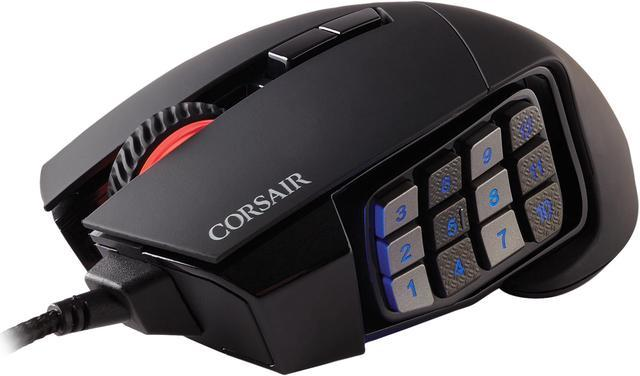
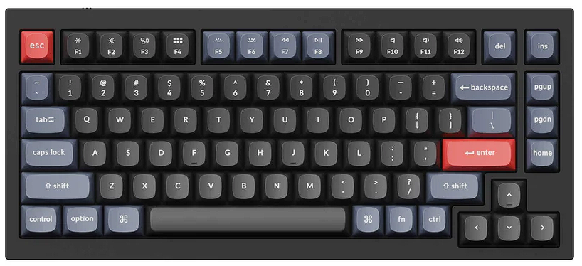
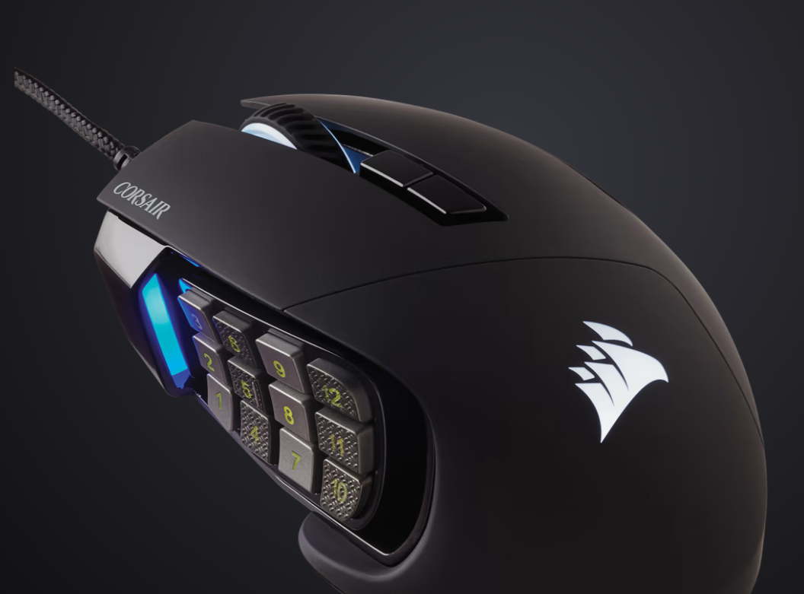
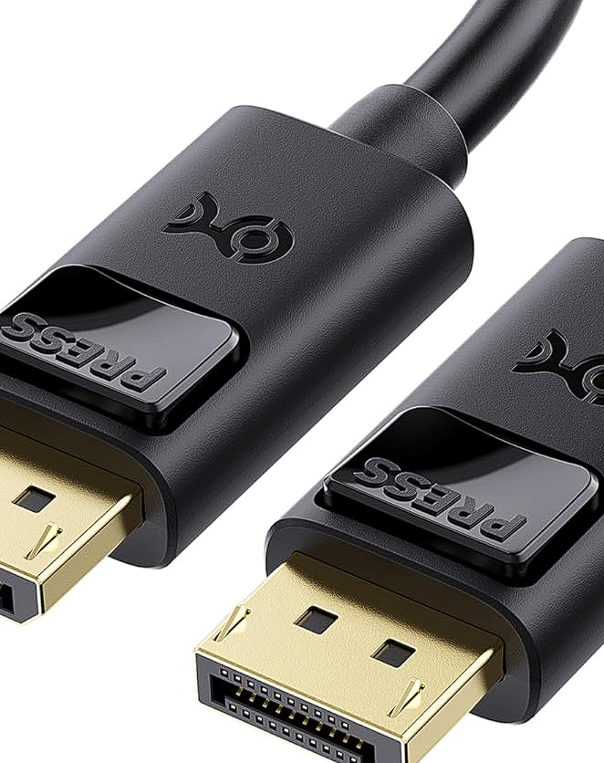

' README.md

' Keychron-Corsair-Dual-Compatibility

' How to pair BOTH keyboard and mouse to seamlessly use your Mac and Windows within a touch of a switch

' 
' (https://www.corsair.com/us/en/p/gaming-mouse/ch-9304211-na/scimitar-rgb-elite-optical-moba-mmo-gaming-mouse-ch-9304211-na)

' 
' (https://www.keychron.com/products/keychron-q1)

' 
' (https://www.dell.com/en-us/shop/dell-performance-dock-wd19dcs/apd/210-azbn/docks)

' 
' (https://www.dell.com/en-us/shop/c2g-6ft-usb-c-to-hdmi-adapter-cable-4k-60hz/apd/aa243620/pc-accessories)

' 
' (https://www.amazon.com/Cable-Matters-DisplayPort-DisplayPort-6-Feet/dp/B005H3Q59U/)

' Device Configuration Setup for macOS and Windows

' This guide provides a step-by-step approach to setting up your Keychron Q1 Pro wireless keyboard (running QMKVIA) and 
' SCIMITAR RGB ELITE Optical MOBA/MMO Gaming Mouse through a Dell USB Dock on both macOS and Windows.

' Steps for macOS

' Install Required Tools:

' Homebrew:
' Run the following command in Terminal to install Homebrew
' /bin/bash -c "$(curl -fsSL https://raw.githubusercontent.com/Homebrew/install/HEAD/install.sh)"

' XQuartz:
' Run the following command in Terminal to install XQuartz
' brew install --cask xquartz

' xinput:
' Run the following command in Terminal to install xinput
' brew install xinput

' Connect Devices:

' - Connect the USB-C to HDMI adapter to the Dell Dock.
' - Connect the DisplayPort to DisplayPort cable from the dock to your monitor.
' - Ensure the Keychron Q1 Pro is connected via Bluetooth or USB.
' - Connect the SCIMITAR RGB ELITE mouse to a USB port on the Dell Dock.

' Verify Device Connection:

' Use Terminal to list all connected input devices:
' xinput list

' Create Configuration Script:

' Create and make the script executable:
' nano configure_devices.sh
' chmod +x configure_devices.sh

' Add the following content to the script:
' cat << 'EOF' > configure_devices.sh
' #!/bin/bash
' 
' # Find the device IDs
' KEYCHRON_ID=$(xinput list | grep 'Keychron Q1 Pro' | awk '{print $6}' | sed 's/id=//')
' SCIMITAR_ID=$(xinput list | grep 'SCIMITAR RGB ELITE' | awk '{print $6}' | sed 's/id=//')
' 
' # Configure Keychron Q1 Pro
' xinput set-prop $KEYCHRON_ID "Device Accel Profile" 1
' 
' # Configure SCIMITAR RGB ELITE Mouse
' xinput set-prop $SCIMITAR_ID "Device Accel Profile" -1
' 
' echo "Devices configured successfully."
' EOF

' Automate Configuration on Startup:

' Add script execution to your shell profile:
' nano ~/.zshrc
' echo "~/path/to/configure_devices.sh" >> ~/.zshrc
' source ~/.zshrc

' Verify Display Settings:

' Go to System Preferences > Displays and ensure your monitor is detected.

' Steps for Windows

' Install Required Software:

' - Corsair iCUE: Download and install from Corsair iCUE.
' - QMK Toolbox: Download and install from QMK Toolbox.

' Connect Devices:

' - Connect the USB-C to HDMI adapter to the Dell Dock.
' - Connect the DisplayPort to DisplayPort cable from the dock to your monitor.
' - Ensure the Keychron Q1 Pro is connected via Bluetooth or USB.
' - Connect the SCIMITAR RGB ELITE mouse to a USB port on the Dell Dock.

' Install and Configure Drivers:

' - Keychron Q1 Pro: Use QMK Toolbox to configure the keyboard if needed.
' - SCIMITAR RGB ELITE Mouse: Use Corsair iCUE to configure the mouse settings (DPI, macros, RGB lighting).

' Verify Device Connection:

' Open Device Manager and ensure both devices are recognized.
' If using Bluetooth, go to Settings > Devices > Bluetooth & other devices to ensure the Keychron Q1 Pro is paired.

' Display Settings:

' Right-click on the desktop and select "Display settings".
' Ensure your monitor is detected and adjust settings as needed.

' Unified Workflow for Both Operating Systems

' Cross-Platform Software:

' QMK Toolbox and Corsair iCUE are available for both macOS and Windows. Use these tools to configure your devices consistently across both systems.

' Configuration Synchronization:

' - Keychron Q1 Pro: Ensure the QMK firmware configuration is saved and flashed using QMK Toolbox, which will work on both operating systems.
' - SCIMITAR RGB ELITE Mouse: Save profiles in Corsair iCUE, which can be imported/exported between systems if needed.

' Physical Connections:

' Ensure the Dell Dock is properly connected to your monitor via DisplayPort and the USB-C to HDMI adapter is correctly connected.
' Check device connections each time you switch between macOS and Windows.

' Script Automation (macOS):

' Automate device configuration with a script on macOS to ensure settings are applied each time you boot.

' Scripts

' - Script for macOS
' (https://github.com/musha1140/Keychron-Corsair-dual-Combability/blob/main/macos_configure.sh)
' - Script for Windows
' (https://github.com/musha1140/Keychron-Corsair-dual-Combability/blob/main/windows_configure.bat)

' Conclusion

' By following these steps, you leverage the power of modern input device configuration tools, cross-platform firmware customization, and peripheral connectivity technologies. 
' This ensures your Keychron Q1 Pro keyboard and SCIMITAR RGB ELITE mouse are correctly set up and configured for use on both macOS and Windows, providing a seamless and consistent experience when switching between operating systems.
